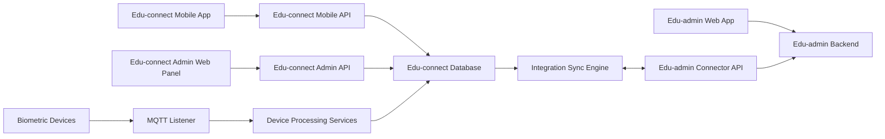
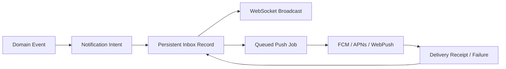

# Edu-connect Integration Architecture

## 1. Purpose

This document defines how Edu-connect should be redesigned so it can work as an independent product and also connect cleanly to Edu-admin.

Edu-connect is the parent, mobile, biometric device, and attendance gateway. Edu-admin is the larger school administration and academic management system. The goal is to let each product keep a clear responsibility while allowing a school to unlock richer mobile features when Edu-connect is connected to Edu-admin.

The current Edu-connect backend started as Rod-Connect. Its existing schema, admin panel, and mobile app can be redesigned. We should not force the old schema to survive if it blocks a better flow of data.

## 2. Product Boundary

Edu-connect has three clients:

1. Edu-connect Admin Web Panel
   - Used by school operators and platform staff to manage devices, parent accounts, mobile access, attendance, integration health, and standalone school data.

2. Edu-connect Mobile App
   - Used by parents and guardians to view children, attendance, messages, results, fees, timetable, discipline notices, and profile settings.

3. Device/MQTT Layer
   - Used by biometric devices to send attendance events and receive personnel sync commands.

Edu-admin has one main responsibility in this integration:

1. Edu-admin API and Web App
   - Owns the full academic ERP context: complexes, schools, academic years, classes, students, staff, results, fees, timetable, discipline, document branding, and official communication.

## 3. Guiding Decisions

### 3.1 No Shared Database

Edu-connect and Edu-admin must not share a database. They communicate through APIs and signed events.

Why:

- Each product can be deployed independently.
- Edu-connect can work offline from Edu-admin for device and mobile continuity.
- The mobile app never needs Edu-admin credentials or URLs.
- Database migrations in one product do not break the other.

### 3.2 Edu-connect Mobile Talks Only To Edu-connect

The mobile app should never call Edu-admin directly.

All mobile APIs live under Edu-connect:

```text
/api/mobile/...
```

Edu-connect decides whether data comes from its local standalone records or from Edu-admin synced records.

### 3.3 Edu-connect Admin Panel Talks Only To Edu-connect

The Edu-connect admin panel should use Edu-connect admin APIs:

```text
/api/admin/...
```

It should expose integration state, sync logs, device state, and mobile feature controls. It should not become an Edu-admin clone.

### 3.4 Edu-admin Owns Academic Truth When Connected

When Edu-connect is connected to Edu-admin, Edu-admin becomes the source of truth for academic data.

Edu-connect may cache that data locally for performance, mobile use, and device workflows, but edits to synced academic records should be limited or disabled in Edu-connect.

### 3.5 Edu-connect Owns Device And Mobile Runtime Truth

Edu-connect owns:

- Biometric devices
- MQTT processing
- Device commands and acknowledgments
- Raw attendance events captured from devices
- Parent mobile sessions
- Mobile notification state
- Mobile read receipts
- Offline delivery state

## 4. Operating Modes

Edu-connect must support two modes.

### 4.1 Standalone Mode

Edu-connect runs without Edu-admin.

Edu-connect owns:

- Complexes or tenants
- Schools
- Academic years
- Sections
- Education options
- Streams
- Classes
- Students
- Parent accounts
- Parent-student links
- Biometric devices
- Attendance events
- Basic messages and announcements

Standalone mode is useful for schools that only want biometric attendance and parent mobile access.

### 4.2 Connected Mode

Edu-connect is linked to Edu-admin.

Edu-admin owns:

- Complexes
- Schools
- Academic years
- Academic structure
- Students
- Staff
- Results
- Fees
- Timetable
- Discipline
- Official communications

Edu-connect owns:

- Parent mobile identities
- Biometric devices
- Device personnel sync
- Raw attendance capture
- Push notifications
- Mobile delivery/read state
- Integration logs

Synced records in Edu-connect should carry ownership metadata:

```text
source_system = local | edu_admin
source_id = external id when source_system is edu_admin
source_updated_at = timestamp from owner system
sync_status = synced | pending | conflicted | deleted_remote
```

## 5. High-Level Architecture



## 6. Ownership Matrix

| Domain | Standalone Owner | Connected Owner | Edu-connect Behavior In Connected Mode |
| --- | --- | --- | --- |
| Tenant/complex | Edu-connect | Edu-admin | Synced read-only copy |
| School | Edu-connect | Edu-admin | Synced read-only copy, local mobile settings allowed |
| Academic year | Edu-connect | Edu-admin | Synced read-only copy |
| Section | Edu-connect | Edu-admin | Synced read-only copy |
| Education option | Edu-connect | Edu-admin | Synced read-only copy |
| Stream/level | Edu-connect | Edu-admin | Synced read-only copy |
| Class | Edu-connect | Edu-admin | Synced read-only copy |
| Student | Edu-connect | Edu-admin | Synced read-only copy plus local device fields |
| Parent account | Edu-connect | Edu-connect | Local owner, may link to Edu-admin parent phone/user |
| Parent-student link | Edu-connect | Shared | Edu-admin approves truth, Edu-connect stores mobile state |
| Biometric device | Edu-connect | Edu-connect | Local owner |
| Device personnel state | Edu-connect | Edu-connect | Local owner based on synced students |
| Attendance event | Edu-connect | Edu-connect capture, Edu-admin receives | Local owner, pushed to Edu-admin |
| Attendance summary | Edu-connect | Both | Edu-connect computes mobile state, Edu-admin stores official copy if enabled |
| Result/report card | Not available or local later | Edu-admin | Edu-connect displays synced/pulled data |
| Fee summary | Not available or local later | Edu-admin | Edu-connect displays synced/pulled data |
| Timetable | Not available or local later | Edu-admin | Edu-connect displays synced/pulled data |
| Discipline notices | Optional local | Edu-admin | Edu-connect displays synced/pulled data |
| Official messages | Edu-connect basic | Edu-admin | Edu-connect delivers to mobile |
| Mobile notifications | Edu-connect | Edu-connect | Local owner |

## 7. Canonical Data Mapping

Edu-connect v2 should use Edu-admin-compatible vocabulary, but it must still keep its own IDs. The mapping table is the bridge between both systems.

### 7.1 Entity Crosswalk

| Edu-admin Entity | Edu-connect Entity | Direction | Notes |
| --- | --- | --- | --- |
| `academic_complexes` | `tenants` | Pull | One Edu-admin complex becomes one Edu-connect tenant. |
| `schools` | `schools` | Pull | Preserve school type, status, branding hints, and timezone/settings where available. |
| `academic_years` | `academic_years` | Pull | Current year drives mobile attendance and reports context. |
| `sections` | `sections` | Pull | Same concept in both systems. |
| `education_options` | `education_options` | Pull | Replaces old Edu-connect `options` naming. |
| `streams` | `streams` | Pull | Replaces old Edu-connect `levels` naming. |
| `classes` | `classes` | Pull | Replaces old Edu-connect `school_classes` naming. |
| `students` | `students` | Pull | Add local device and mobile visibility fields in Edu-connect. |
| `users` with parent role | `parent_accounts` | Optional pull/match | Edu-connect owns mobile identity; match mainly by normalized phone. |
| `parent_student_links` | `parent_student_links` | Pull and request push | Official links come from Edu-admin; mobile requests may be pushed back for approval. |
| `communication_messages` | `mobile_messages` | Pull | Edu-admin publishes official messages; Edu-connect handles delivery/read state. |
| Edu-connect `attendance_events` | Edu-admin attendance/discipline module | Push | Edu-connect captures raw events; Edu-admin stores official attendance copy if enabled. |
| Edu-connect `biometric_devices` | Edu-admin device status view | Push summary | Edu-connect owns devices; Edu-admin may display health and last activity. |

### 7.2 Field Mapping Rules

General rules:

- Every synced row stores `source_system = edu_admin`.
- Every synced row stores Edu-admin ID in `source_id`.
- Every synced row has a row in `integration_mappings`.
- Edu-connect local IDs are never sent to mobile as Edu-admin IDs.
- Mobile APIs may expose opaque IDs or Edu-connect IDs only.

Important transforms:

```text
Edu-admin academic_complexes.id -> Edu-connect tenants.source_id
Edu-admin schools.complex_id -> Edu-connect schools.tenant_id through mapping
Edu-admin sections.school_id -> Edu-connect sections.school_id through mapping
Edu-admin education_options.section_id -> Edu-connect education_options.section_id through mapping
Edu-admin streams.education_option_id -> Edu-connect streams.education_option_id through mapping
Edu-admin classes.stream_id -> Edu-connect classes.stream_id through mapping
Edu-admin students.school_id -> Edu-connect students.school_id through mapping
Edu-admin students.class_id -> Edu-connect students.class_id through mapping
Edu-admin students.parent_phone -> Edu-connect student contact hint, not a mobile link security check
Edu-admin parent_student_links.student_id -> Edu-connect parent_student_links.student_id through mapping
Edu-admin parent_student_links.linking_code -> Edu-connect child link code
Edu-admin parent access QR -> educonnect://link?code={linking_code}&student_number={student_number}
```

Phone normalization:

```text
+237 6 77 00 00 00
237677000000
677000000
```

All should resolve to one canonical representation for parent account profiles and contact search. Phone no longer has to match before a parent can link a child with a valid code.

Child link code handling:

```text
ABC12345
abc12345
ABC-12345
educonnect://link?code=ABC12345&student_number=STU-001
```

All should resolve to the same normalized linking code before Edu-connect checks the synced parent access link. If the QR payload contains `student_number`, Edu-connect uses it as an ambiguity guard but still treats the code as the main authorization secret.

Recommended canonical format:

```text
E.164 where possible: +237677000000
```

### 7.3 Local Extensions On Synced Records

Synced records may have local-only extension fields. These must never be pushed back to Edu-admin unless the connector explicitly supports them.

Examples:

```text
schools.mobile_settings
students.device_sync_enabled
students.mobile_visible
biometric_devices.*
attendance_events.*
mobile_message_recipients.read_at
mobile_notifications.*
```

### 7.4 ID Policy

Use integer primary keys internally unless the Laravel project standard changes. Add UUIDs only where they solve a real external reference problem.

Recommended externally visible identifiers:

```text
attendance_events.event_key
device_commands.command_key
integration_outbox_events.event_key
integration_inbox_events.event_key
```

These keys should be stable and idempotent.

## 8. Redesigned Edu-connect Schema

This schema intentionally follows Edu-admin vocabulary so integration is natural.

During the transition from the current Edu-connect v1/Rod-Connect schema, physical v2 table names should use an `ec_` prefix, for example `ec_schools`, `ec_students`, and `ec_attendance_events`. This prevents collisions with current v1 tables like `schools`, `students`, and `student_logs`.

The domain names in this document remain the canonical v2 names. The `ec_` prefix is the physical database namespace used while v1 and v2 coexist.

### 8.1 Core Tenant Tables

#### `tenants`

Represents an academic complex or standalone organization.

Key columns:

```text
id
name
slug
code
status
source_system
source_id
settings json
created_at
updated_at
deleted_at
```

Notes:

- In connected mode, one Edu-admin academic complex maps to one Edu-connect tenant.
- In standalone mode, Edu-connect creates tenants locally.

#### `schools`

Key columns:

```text
id
tenant_id
name
slug
code
type
phone
email
address
city
timezone
logo_path
status
source_system
source_id
source_updated_at
settings json
mobile_settings json
created_at
updated_at
deleted_at
```

`mobile_settings` remains editable in Edu-connect even when the school is synced from Edu-admin.

### 8.2 Academic Structure Tables

#### `academic_years`

```text
id
tenant_id
school_id nullable
name
start_date
end_date
is_current
status
source_system
source_id
source_updated_at
created_at
updated_at
deleted_at
```

#### `sections`

```text
id
tenant_id
school_id
name
code
sort_order
status
source_system
source_id
source_updated_at
created_at
updated_at
deleted_at
```

#### `education_options`

```text
id
tenant_id
school_id
section_id
name
code
sort_order
status
source_system
source_id
source_updated_at
created_at
updated_at
deleted_at
```

#### `streams`

Edu-admin uses streams for grade levels like Nursery 1, Class 1, Form 1. Edu-connect should use the same name.

```text
id
tenant_id
school_id
section_id
education_option_id nullable
name
display_name
grade_level
sort_order
status
source_system
source_id
source_updated_at
created_at
updated_at
deleted_at
```

#### `classes`

```text
id
tenant_id
school_id
stream_id
name
full_name
capacity
current_enrollment
class_teacher_name nullable
class_teacher_external_id nullable
status
source_system
source_id
source_updated_at
created_at
updated_at
deleted_at
```

### 8.3 People Tables

#### `students`

```text
id
tenant_id
school_id
class_id nullable
student_number
first_name
last_name
middle_name nullable
date_of_birth nullable
gender nullable
photo_path nullable
photo_hash nullable
biometric_identifier nullable
status
parent_name nullable
parent_phone nullable
parent_email nullable
emergency_contact_name nullable
emergency_contact_phone nullable
source_system
source_id
source_updated_at
device_sync_enabled boolean
mobile_visible boolean
created_at
updated_at
deleted_at
```

Notes:

- `biometric_identifier` is the value used by devices.
- `device_sync_enabled` is local to Edu-connect.
- `mobile_visible` lets a school hide a student from the mobile app without deleting the synced record.

#### `parent_accounts`

Edu-connect owns mobile parent identity.

```text
id
phone
email nullable
first_name
last_name
region nullable
address nullable
preferred_language
status
last_login_at nullable
phone_verified_at nullable
email_verified_at nullable
password_hash nullable
otp_secret nullable
settings json
created_at
updated_at
deleted_at
```

Notes:

- Mobile auth can start with OTP.
- Password login can be added later.
- Parent accounts are not automatically the same as Edu-admin users.

#### `parent_student_links`

```text
id
tenant_id
school_id
parent_account_id nullable
student_id
parent_phone
linking_code nullable
relationship
relationship_description nullable
is_primary_contact boolean
can_pick_up boolean
emergency_contact boolean
communication_preferences json
status
requested_at nullable
verified_at nullable
linked_at nullable
source_system
source_id
source_updated_at
created_at
updated_at
deleted_at
```

Statuses:

```text
pending
verified
suspended
rejected
revoked
```

Connected mode rule:

- Edu-admin may create official links.
- Edu-connect may allow a parent to request linking by code.
- Edu-admin should approve or reject the request if the school requires approval.

### 8.4 Device Tables

#### `biometric_devices`

```text
id
tenant_id
school_id
name
device_uid
serial_number nullable
mac_address nullable
ip_address nullable
location
device_type
firmware_version nullable
mqtt_client_id nullable
mqtt_command_topic
mqtt_recognition_topic
status
last_heartbeat_at nullable
last_seen_at nullable
settings json
created_at
updated_at
deleted_at
```

Statuses:

```text
active
inactive
online
offline
maintenance
blocked
```

#### `device_personnel`

Tracks which students should be on which device and whether they were synced successfully.

```text
id
tenant_id
school_id
device_id
student_id
person_identifier
payload_hash
sync_status
last_synced_at nullable
last_ack_at nullable
last_error nullable
created_at
updated_at
```

Sync statuses:

```text
pending
queued
sent
acknowledged
failed
removed
```

#### `device_commands`

```text
id
tenant_id
school_id
device_id
command_type
command_key unique
payload json
status
attempts
last_error nullable
queued_at
sent_at nullable
acknowledged_at nullable
created_at
updated_at
```

`command_key` makes retries idempotent.

#### `device_acks`

```text
id
device_id
command_id nullable
ack_type
payload json
received_at
created_at
```

### 8.5 Attendance Tables

#### `attendance_events`

Raw captured attendance event.

```text
id
tenant_id
school_id
student_id nullable
device_id
external_event_id nullable
event_key unique
event_type
event_time
confidence_score nullable
verify_status nullable
raw_payload json
photo_path nullable
processing_status
edu_admin_sync_status
edu_admin_synced_at nullable
edu_admin_error nullable
created_at
updated_at
```

Event types:

```text
check_in
check_out
recognition_failed
unknown_person
manual_adjustment
```

`event_key` should be generated from stable device data:

```text
sha256(device_uid + person_identifier + event_time + event_type + raw_sequence_if_available)
```

This prevents duplicate attendance records when MQTT messages are retried.

#### `attendance_daily_states`

Optimized daily summary for mobile dashboards.

```text
id
tenant_id
school_id
student_id
date
first_check_in_at nullable
last_check_out_at nullable
status
late_minutes nullable
source_event_ids json
created_at
updated_at
```

Statuses:

```text
not_arrived
checked_in
checked_out
absent
manual
```

### 8.6 Mobile Communication Tables

#### `mobile_messages`

Represents messages visible in the mobile app. Some are local Edu-connect messages, some are synced from Edu-admin Communication Center.

```text
id
tenant_id
school_id
academic_year_id nullable
source_system
source_id nullable
sender_type
sender_name
category
priority
title
body
audience_type
audience_filters json
status
published_at nullable
expires_at nullable
created_at
updated_at
deleted_at
```

#### `mobile_message_recipients`

```text
id
message_id
parent_account_id nullable
student_id nullable
recipient_phone nullable
delivery_status
read_at nullable
delivered_at nullable
created_at
updated_at
```

#### `mobile_notifications`

```text
id
parent_account_id
tenant_id
school_id nullable
type
title
body
data json
priority
channel
delivery_status
read_at nullable
sent_at nullable
expires_at nullable
created_at
updated_at
```

#### `mobile_push_tokens`

Stores devices that can receive push notifications.

```text
id
parent_account_id
token
provider
platform
device_name nullable
app_version nullable
locale nullable
timezone nullable
last_seen_at nullable
revoked_at nullable
created_at
updated_at
```

Providers:

```text
fcm
apns
web_push
```

Platforms:

```text
android
ios
web
windows
macos
```

Unique constraint:

```text
unique(provider, token)
```

#### `notification_deliveries`

Tracks each push/in-app delivery attempt.

```text
id
notification_id
push_token_id nullable
provider
status
attempts
provider_message_id nullable
provider_response nullable json
last_error nullable
queued_at
sent_at nullable
delivered_at nullable
failed_at nullable
next_attempt_at nullable
created_at
updated_at
```

Statuses:

```text
queued
sent
delivered
failed
token_invalid
skipped
```

#### `notification_preferences`

Stores parent preferences by category.

```text
id
parent_account_id
category
in_app_enabled boolean
push_enabled boolean
sms_enabled boolean
email_enabled boolean
quiet_hours_start nullable
quiet_hours_end nullable
created_at
updated_at
```

Categories:

```text
attendance
messages
results
fees
timetable
discipline
system
marketing
```

#### `realtime_subscriptions`

Optional table for tracking active WebSocket subscriptions when the realtime server supports presence state callbacks.

```text
id
parent_account_id nullable
admin_user_id nullable
channel_name
socket_id
connected_at
last_seen_at
disconnected_at nullable
metadata json nullable
created_at
updated_at
```

#### `conversation_threads`

Supports true two-way chat when enabled. Official broadcast messages can continue using `mobile_messages`; chat uses conversations.

```text
id
tenant_id
school_id
class_id nullable
student_id nullable
type
title
status
source_system
source_id nullable
metadata json nullable
last_message_at nullable
created_by_type
created_by_id nullable
created_at
updated_at
deleted_at
```

Types:

```text
direct
class_group
school_channel
```

Implemented conversation meanings:

- `direct`: a controlled parent-to-administration thread about one linked student.
- `class_group`: a class parent group for parents with active linked children in that class, plus school administrators.
- `school_channel`: a school information forum created by administrators. Parents in that school can read it; parent posting is disabled by default and controlled by `metadata.parents_can_post`.

Parent access is derived from active `parent_student_links`, so a parent with children in multiple schools can see only the schools, classes, students, channels, and conversation threads attached to those children.

#### `conversation_participants`

```text
id
thread_id
participant_type
participant_id nullable
display_name
role
last_read_message_id nullable
muted_until nullable
joined_at
left_at nullable
created_at
updated_at
```

Participant types:

```text
parent_account
admin_user
edu_admin_user
system
```

#### `conversation_messages`

```text
id
thread_id
sender_type
sender_id nullable
sender_display_name
message_type
body nullable
metadata json nullable
status
sent_at
edited_at nullable
deleted_at nullable
created_at
updated_at
```

Message types:

```text
text
image
file
attendance
system
```

#### `conversation_message_receipts`

```text
id
message_id
participant_id
delivered_at nullable
read_at nullable
created_at
updated_at
```

### 8.7 Integration Tables

#### `integration_connections`

```text
id
tenant_id
provider
mode
base_url
api_version
remote_tenant_id nullable
status
scopes json
feature_flags json
encrypted_access_token nullable
encrypted_refresh_token nullable
webhook_secret nullable
last_successful_sync_at nullable
last_failed_sync_at nullable
last_error nullable
created_at
updated_at
```

Providers:

```text
edu_admin
```

Modes:

```text
standalone
connected
paused
disconnecting
```

Feature flags:

```json
{
  "sync_academic_structure": true,
  "sync_students": true,
  "sync_parent_links": true,
  "push_attendance": true,
  "pull_results": true,
  "pull_fees": true,
  "pull_timetable": true,
  "pull_discipline": true,
  "pull_messages": true
}
```

#### `integration_mappings`

```text
id
connection_id
local_type
local_id
external_type
external_id
external_updated_at nullable
checksum nullable
created_at
updated_at
```

Unique constraints:

```text
unique(connection_id, local_type, local_id)
unique(connection_id, external_type, external_id)
```

#### `integration_sync_runs`

```text
id
connection_id
sync_type
direction
status
cursor_before nullable
cursor_after nullable
started_at
finished_at nullable
records_read integer
records_created integer
records_updated integer
records_deleted integer
records_failed integer
error_message nullable
created_at
updated_at
```

Directions:

```text
pull
push
bidirectional
```

#### `integration_sync_items`

```text
id
sync_run_id
local_type nullable
local_id nullable
external_type nullable
external_id nullable
action
status
error_message nullable
created_at
updated_at
```

#### `integration_outbox_events`

Events created by Edu-connect that must be pushed to Edu-admin.

```text
id
connection_id
event_type
event_key unique
payload json
status
attempts
available_at
sent_at nullable
last_error nullable
created_at
updated_at
```

#### `integration_inbox_events`

Events received from Edu-admin.

```text
id
connection_id
event_type
event_key unique
payload json
processed_at nullable
status
error_message nullable
created_at
updated_at
```

#### `integration_audit_events`

Operator-facing audit timeline entries for sync, outbox, message ingestion, and credential actions.

```text
id
tenant_id nullable
connection_id nullable
category
event_type
severity
status nullable
summary
metadata json nullable
actor_type nullable
actor_id nullable
related_type nullable
related_id nullable
occurred_at
created_at
updated_at
```

Audit metadata must never contain access tokens, webhook secrets, passwords, OTPs, or other plaintext credentials. Store counters, IDs, changed field names, and redacted presence/action flags instead.

## 9. Backend Module Layout

Edu-connect backend should be organized by domain, not by the old Rod-Connect prototype shape.

Recommended Laravel service layout:

```text
app/
  Actions/
    Attendance/
    Devices/
    Integrations/
    Mobile/
  Contracts/
    EduAdminConnector.php
  Data/
    Device/
    Integration/
    Mobile/
  Events/
    AttendanceEventCaptured.php
    AttendanceEventSynced.php
    DeviceHeartbeatReceived.php
    ParentChildLinked.php
  Http/
    Controllers/
      Admin/
      Device/
      Integration/
      Mobile/
    Middleware/
  Jobs/
    Devices/
    Integrations/
    Notifications/
  Models/
  Services/
    Attendance/
      AttendanceEventRecorder.php
      DailyStateBuilder.php
    Devices/
      DeviceCommandBuilder.php
      MqttMessageProcessor.php
      PersonnelSyncService.php
    Integration/
      EduAdminClient.php
      MappingService.php
      OutboxPublisher.php
      SyncCoordinator.php
      SyncCursorStore.php
    Mobile/
      ChildLinkingService.php
      MobileFeatureService.php
      ParentAuthService.php
```

Recommended route files:

```text
routes/admin_api.php
routes/mobile_api.php
routes/device_api.php
routes/integration_api.php
```

If keeping a single `routes/api.php`, group routes clearly by prefix and middleware.

Recommended config files:

```text
config/educonnect.php
config/integrations.php
config/mqtt.php
```

`config/educonnect.php` should include:

```php
return [
    'mode' => env('EDUCONNECT_MODE', 'standalone'),
    'mobile_token_expiration_minutes' => env('MOBILE_TOKEN_EXPIRATION', 43200),
    'attendance_photo_retention_days' => env('ATTENDANCE_PHOTO_RETENTION_DAYS', 7),
];
```

## 10. Edu-admin Connector API

Edu-admin should expose a dedicated versioned connector API. These endpoints should not be mixed with normal user-facing app routes.

Suggested prefix:

```text
/api/v1/integrations/edu-connect
```

### 10.1 Authentication

Use service-to-service authentication.

Recommended:

1. Edu-admin issues a connector credential scoped to one academic complex.
2. Edu-connect stores the issued bearer token and webhook secret encrypted.
3. Every request includes:

```text
Authorization: Bearer {token}
X-Edu-Connect-Tenant: {tenant_id}
X-Request-Id: {uuid}
Idempotency-Key: {uuid or event_key for writes}
```

For write requests, add HMAC signatures over the exact JSON request body:

```text
X-Edu-Connect-Timestamp: {unix_timestamp}
X-Edu-Connect-Signature: sha256={hmac_sha256(timestamp + "." + raw_body)}
```

The timestamp must be fresh within Edu-admin's configured tolerance window. Edu-admin currently applies this to `POST /api/v1/integrations/edu-connect/attendance-events`.

Implemented connector credential model:

- Edu-admin stores each connector credential in `edu_connect_connector_credentials`.
- Each credential belongs to one `academic_complex`.
- Bearer tokens are stored as SHA-256 hashes only.
- HMAC webhook secrets are encrypted at rest.
- Credentials support scopes, expiry, rotation, revocation, and last-used tracking.
- The issued bearer token and webhook secret are returned only once during issue or rotation.
- Supported scopes:
  - `foundation:read`
  - `messages:read`
  - `attendance:write`
  - `connector:*`

Edu-admin operators can issue or revoke credentials with:

```bash
php artisan educonnect:issue-credential {complex_id}
php artisan educonnect:revoke-credential {credential_id}
```

Protected Edu-admin credential API:

```http
GET  /api/integrations/edu-connect/credentials
POST /api/integrations/edu-connect/credentials
POST /api/integrations/edu-connect/credentials/{credential}/rotate
POST /api/integrations/edu-connect/credentials/{credential}/revoke
```

Implemented Edu-admin credential audit:

- Edu-admin stores connector credential audit entries in `edu_connect_connector_audit_events`.
- API issue, rotate, and revoke actions store actor metadata.
- CLI issue and revoke commands store `source=cli`.
- Audit metadata stores credential snapshots, changed fields, and action flags without plaintext access tokens or webhook secrets.

Edu-connect:

```text
EDU_ADMIN_CONNECTOR_DRIVER=http
EDU_ADMIN_CONNECTOR_API_VERSION=v1
EDU_ADMIN_CONNECTOR_TIMEOUT=15
EDU_ADMIN_CONNECTOR_RETRIES=3
```

Edu-connect stores the issued access token encrypted in `ec_integration_connections.encrypted_access_token`, stores the issued HMAC secret encrypted in `ec_integration_connections.webhook_secret`, and never returns either secret from admin API responses. Edu-admin validates `Authorization: Bearer {token}` against the stored token hash, scopes the request to the credential's complex, enforces connector scopes, and verifies HMAC headers on write routes.

Legacy single-token environment credentials are disabled by default. They should only be enabled temporarily with `EDU_CONNECT_CONNECTOR_LEGACY_ENV_CREDENTIALS=true` while migrating an existing installation. New installations should use persisted per-complex connector credentials from the start.

### 10.2 Bootstrap Endpoint

```http
GET /api/v1/integrations/edu-connect/bootstrap
```

Returns:

```json
{
  "complex": {},
  "features": {},
  "schools": [],
  "current_academic_years": [],
  "server_time": "2026-08-07T00:00:00Z",
  "cursor": "opaque-cursor"
}
```

Purpose:

- Verify connection.
- Return identity of the remote complex.
- Return enabled capabilities.
- Provide initial sync cursor.

### 10.3 Resource Pull Endpoints

```http
GET /api/v1/integrations/edu-connect/academic-years?cursor=...
GET /api/v1/integrations/edu-connect/schools?cursor=...
GET /api/v1/integrations/edu-connect/sections?cursor=...
GET /api/v1/integrations/edu-connect/education-options?cursor=...
GET /api/v1/integrations/edu-connect/streams?cursor=...
GET /api/v1/integrations/edu-connect/classes?cursor=...
GET /api/v1/integrations/edu-connect/students?cursor=...
GET /api/v1/integrations/edu-connect/parent-links?cursor=...
GET /api/v1/integrations/edu-connect/staff?cursor=...
```

Implemented transition endpoint:

```http
GET /api/v1/integrations/edu-connect/resources/{resource}?cursor=...&limit=250
```

Supported `resource` values:

```text
schools
academic_years
sections
education_options
streams
classes
students
parent_links
```

Response format:

```json
{
  "data": [],
  "next_cursor": "opaque-cursor",
  "has_more": false
}
```

Transition pagination uses ascending numeric IDs as cursors. The cursor may later become opaque without changing the Edu-connect `EduAdminConnector` contract.

Every object should include:

```json
{
  "id": 123,
  "updated_at": "2026-08-07T12:00:00Z",
  "deleted_at": null
}
```

### 10.4 Attendance Push Endpoint

```http
POST /api/v1/integrations/edu-connect/attendance-events
```

Request:

```json
{
  "events": [
    {
      "event_key": "sha256...",
      "local_event_id": 4812,
      "school_id": 10,
      "student_id": 235,
      "class_id": 42,
      "device_uid": "2581924_ipobexa",
      "event_type": "check_in",
      "event_time": "2026-08-07T07:25:00+01:00",
      "confidence_score": 95.5,
      "raw_payload": {}
    }
  ]
}
```

Response:

```json
{
  "accepted": ["sha256..."],
  "duplicates": [],
  "rejected": []
}
```

Rules:

- Edu-admin must treat `event_key` as idempotent.
- Duplicate events should return as duplicates, not errors.
- Edu-admin should store the original Edu-connect event key.
- Edu-admin should reject events that fall outside the authorized complex graph.
- Edu-connect should mark both `accepted` and `duplicates` as synced locally.
- Edu-connect should retry `rejected` or unacknowledged events through `integration_outbox_events`.

Implemented bridge:

```text
Edu-connect service: App\Services\Integration\AttendanceOutboxDispatcher
Edu-connect command: php artisan educonnect:push-attendance {connection_id}
Edu-admin route: POST /api/v1/integrations/edu-connect/attendance-events
Edu-admin idempotency field: discipline_attendance_records.edu_connect_event_key
Edu-admin signature middleware: App\Http\Middleware\EnsureEduConnectConnectorSignature
```

### 10.5 Device Status Push Endpoint

```http
POST /api/v1/integrations/edu-connect/device-status
```

Purpose:

- Let Edu-admin show device health without owning devices.

### 10.6 Message Pull Endpoint

```http
GET /api/v1/integrations/edu-connect/mobile-messages?cursor=...
```

Purpose:

- Let Edu-admin Communication Center publish official messages to Edu-connect mobile users.

### 10.7 Result, Fee, Timetable, Discipline Endpoints

These can be added after attendance and parent linking are stable:

```http
GET /api/v1/integrations/edu-connect/students/{studentId}/results
GET /api/v1/integrations/edu-connect/students/{studentId}/fees
GET /api/v1/integrations/edu-connect/students/{studentId}/timetable
GET /api/v1/integrations/edu-connect/students/{studentId}/discipline
```

These may be pulled on demand rather than fully synced.

## 11. Edu-connect Backend APIs

Edu-connect should expose separate API groups for each client.

### 11.1 Admin API

Prefix:

```text
/api/admin
```

Core endpoints:

```http
GET    /api/admin/dashboard
GET    /api/admin/schools
POST   /api/admin/schools
PUT    /api/admin/schools/{school}
GET    /api/admin/students
POST   /api/admin/students
PUT    /api/admin/students/{student}
GET    /api/admin/parents
GET    /api/admin/parent-student-links
POST   /api/admin/parent-student-links
PUT    /api/admin/parent-student-links/{link}
GET    /api/admin/devices
POST   /api/admin/devices
PUT    /api/admin/devices/{device}
POST   /api/admin/devices/{device}/sync-students
GET    /api/admin/attendance/events
GET    /api/admin/attendance/daily-states
GET    /api/admin/messages
POST   /api/admin/messages
GET    /api/admin/v2/conversations
GET    /api/admin/v2/conversations/{thread}
POST   /api/admin/v2/conversations/{thread}/messages
POST   /api/admin/v2/conversations/{thread}/read
PATCH  /api/admin/v2/conversations/{thread}/status
GET    /api/admin/notifications
GET    /api/admin/notifications/deliveries
POST   /api/admin/notifications/test-push
GET    /api/admin/integrations
POST   /api/admin/integrations/edu-admin/connect
POST   /api/admin/integrations/{connection}/test
POST   /api/admin/integrations/{connection}/sync-now
POST   /api/admin/integrations/{connection}/pause
POST   /api/admin/integrations/{connection}/resume
GET    /api/admin/integrations/{connection}/sync-runs
GET    /api/admin/integrations/{connection}/mappings
```

Implemented v2 transition endpoints:

```http
GET    /api/admin/v2/foundation
GET    /api/admin/v2/integration-connections
POST   /api/admin/v2/integration-connections
GET    /api/admin/v2/integration-connections/{connection}
PATCH  /api/admin/v2/integration-connections/{connection}
DELETE /api/admin/v2/integration-connections/{connection}
POST   /api/admin/v2/integration-connections/{connection}/sync-initial
POST   /api/admin/v2/integration-connections/{connection}/sync-incremental
GET    /api/admin/v2/integration-connections/{connection}/sync-runs
GET    /api/admin/v2/conversations
GET    /api/admin/v2/conversations/{thread}
POST   /api/admin/v2/conversations/{thread}/messages
POST   /api/admin/v2/conversations/{thread}/read
PATCH  /api/admin/v2/conversations/{thread}/status
```

Implemented admin web transition routes:

```http
GET  /admin/integrations
POST /admin/integrations/{connection}/sync-initial
POST /admin/integrations/{connection}/sync-incremental
POST /admin/integrations/{connection}/push-attendance
```

Admin v2 auth:

- Protected admin v2 integration endpoints use Sanctum plus an active `AdminUser` check.
- Super admins can manage any v2 tenant connection.
- School admins are scoped through a transition bridge: legacy `admin_users.school_id` maps to an `ec_schools` row with `source_system = legacy` and `source_id = admin_users.school_id`, then access is limited to that row's `tenant_id`.
- Connection tokens are accepted only as write-only request fields and are not returned in API responses.
- Class group and school channel threads are system-managed from existing class/school records; admins can list, read, reply, mark read, and update status for threads inside their scope, but they do not create those spaces manually.

Initial sync trigger:

- `POST /api/admin/v2/integration-connections/{connection}/sync-initial` runs the first Edu-admin pull synchronously for now.
- `php artisan educonnect:sync-initial {connection_id}` gives operators the same trigger from CLI.
- Sync runs record `triggered_by_type`, `triggered_by_id`, and metadata.
- The connection stores `last_successful_sync_at`, `last_failed_sync_at`, and `last_error` rollup fields.
- The current implementation supports both `fixture` and `http` connector drivers.

Incremental sync trigger:

- `POST /api/admin/v2/integration-connections/{connection}/sync-incremental` runs changed-record pulls and can limit resources.
- `POST /admin/integrations/{connection}/sync-incremental` exposes the same action on the admin integration dashboard.
- `php artisan educonnect:sync-incremental {connection_id}` gives operators the same trigger from CLI.
- Incremental runs store `updated_after`, resource names, and per-resource cursors on `ec_integration_sync_runs`.

Connected mode behavior:

- Synced academic records are read-only in admin panel.
- Local-only fields like device sync, mobile visibility, and mobile settings remain editable.

### 11.2 Mobile API

Prefix:

```text
/api/mobile
```

Auth:

```http
POST /api/mobile/auth/request-otp
POST /api/mobile/auth/verify-otp
POST /api/mobile/auth/logout
GET  /api/mobile/me
PUT  /api/mobile/me
```

Children:

```http
GET  /api/mobile/children
POST /api/mobile/children/link
GET  /api/mobile/children/{child}
GET  /api/mobile/children/{child}/attendance
GET  /api/mobile/children/{child}/messages
GET  /api/mobile/children/{child}/results
GET  /api/mobile/children/{child}/fees
GET  /api/mobile/children/{child}/timetable
GET  /api/mobile/children/{child}/discipline
```

Messages:

```http
GET  /api/mobile/messages
GET  /api/mobile/messages/{message}
POST /api/mobile/messages/{message}/read
POST /api/mobile/messages/{message}/reaction
```

Conversations:

```http
GET  /api/mobile/v2/conversations
POST /api/mobile/v2/conversations/direct
GET  /api/mobile/v2/conversations/{thread}
POST /api/mobile/v2/conversations/{thread}/messages
POST /api/mobile/v2/conversations/{thread}/read
```

Implemented mobile conversation rules:

- Parents can start `direct` support threads only for active linked children.
- Each class has one system-managed `class_group` thread.
- Each school has one system-managed `school_channel` thread.
- Successful child-code linking automatically ensures the linked child's class group and school channel.
- Conversation listing and realtime config also lazily ensure default threads for existing active links.
- Parents can read and post in `class_group` threads only when they have an active linked child in that class.
- Parents can read `school_channel` threads only when they have an active linked child in that school.
- Parents with children in different schools automatically receive each linked child's class group and each linked child's school channel.
- Parents cannot post in school channels unless `metadata.parents_can_post` is true.
- Messages create durable conversation records, receipts, unread counts, mobile notifications, and realtime channel names.

Notifications:

```http
GET  /api/mobile/notifications
POST /api/mobile/notifications/{notification}/read
POST /api/mobile/notifications/read-all
GET  /api/mobile/notification-preferences
PUT  /api/mobile/notification-preferences
POST /api/mobile/push-tokens
DELETE /api/mobile/push-tokens/{tokenId}
```

Implemented mobile v2 transition endpoints:

```http
GET    /api/mobile/v2/config
POST   /api/mobile/v2/auth/register
POST   /api/mobile/v2/auth/login
POST   /api/mobile/v2/auth/logout
GET    /api/mobile/v2/me
PATCH  /api/mobile/v2/me
GET    /api/mobile/v2/children
POST   /api/mobile/v2/children/link
GET    /api/mobile/v2/children/{student}
GET    /api/mobile/v2/children/{student}/attendance
GET    /api/mobile/v2/messages
GET    /api/mobile/v2/messages/{message}
POST   /api/mobile/v2/messages/{message}/read
GET    /api/mobile/v2/conversations
POST   /api/mobile/v2/conversations/direct
GET    /api/mobile/v2/conversations/{thread}
POST   /api/mobile/v2/conversations/{thread}/messages
POST   /api/mobile/v2/conversations/{thread}/read
POST   /api/mobile/v2/push-tokens
DELETE /api/mobile/v2/push-tokens
GET    /api/mobile/v2/notifications
POST   /api/mobile/v2/notifications/read-all
POST   /api/mobile/v2/notifications/{notification}/read
GET    /api/mobile/v2/notification-preferences
PUT    /api/mobile/v2/notification-preferences
GET    /api/mobile/v2/realtime/config
POST   /api/mobile/v2/realtime/auth
POST   /api/mobile/v2/realtime/heartbeat
```

Mobile v2 auth:

- Protected mobile v2 routes use Sanctum plus the `mobile.parent` middleware.
- The authenticated user must be an active `ec_parent_accounts` record.
- `ParentAccount` can issue mobile tokens and hides password/OTP fields from JSON responses.
- This transition slice uses password-backed register/login endpoints to unblock Flutter API integration. The target production UX remains OTP request/verification after the SMS or WhatsApp provider is selected.

Mobile child linking:

- A parent links a child with a valid `linking_code`; the authenticated parent account phone does not need to match the school contact phone.
- If a code matches multiple children, the mobile app must also send `student_number`.
- A child can have a maximum of two active parent accounts.
- The same parent account cannot be linked to the same child twice.
- Successful linking attaches `parent_account_id`, activates the link, stamps verification/link times, and marks the parent phone as verified.
- Successful linking also ensures system-managed class group and school channel conversation access for that child.
- Linked child reads return only active, mobile-visible students.

Mobile messages:

- `GET /api/mobile/v2/messages` lists published, visible message recipients for the authenticated parent.
- `read_status=read|unread|all`, `category`, `school_id`, `student_id`, and `limit` filters are supported.
- `GET /api/mobile/v2/messages/{message}` returns a parent-owned message and the current parent's recipient rows.
- `POST /api/mobile/v2/messages/{message}/read` marks all of that parent's recipients for the message as read.
- `MobileMessagePublisher` expands published `ec_mobile_messages` into `ec_mobile_message_recipients`.
- `php artisan educonnect:publish-mobile-messages` publishes due messages in batch and is idempotent for existing recipients.
- Published messages also create `messages` mobile notifications according to parent notification preferences.
- `AttendanceEvent::created` creates `attendance` mobile notifications for active linked parents through `AttendanceNotificationService`.

Mobile push tokens:

- `POST /api/mobile/v2/push-tokens` upserts a token by provider and token value, reassigning it to the current parent account when needed.
- `DELETE /api/mobile/v2/push-tokens` revokes a token for the current parent account.
- `PushNotificationDispatcher` consumes active push tokens and creates rows in `ec_notification_deliveries`.
- `php artisan educonnect:dispatch-push-notifications` runs the first worker loop.
- `PUSH_TRANSPORT=log` remains the local default and marks provider deliveries sent without external FCM/APNS calls.
- `PUSH_TRANSPORT=provider` routes each delivery through the saved push token provider.
- FCM tokens are sent through Firebase Cloud Messaging HTTP v1.
- APNS tokens are sent through Apple Push Notification service provider-token auth.
- Provider responses and retry timing are stored on `ec_notification_deliveries`.
- Invalid provider tokens are revoked automatically; transient provider failures remain retryable until `PUSH_MAX_ATTEMPTS`.

Mobile notifications:

- `GET /api/mobile/v2/notifications` returns visible, non-expired notifications for the authenticated parent.
- `read_status=read|unread|all`, `type`, `school_id`, and `limit` filters are supported.
- `POST /api/mobile/v2/notifications/{notification}/read` marks one parent-owned notification as read.
- `POST /api/mobile/v2/notifications/read-all` bulk marks visible notifications as read, optionally filtered by type or school.
- Notification preferences are per parent and category. Missing categories default to in-app and push enabled, SMS and email disabled.

Realtime:

```http
POST /api/mobile/realtime/auth
GET  /api/mobile/realtime/config
```

Implemented mobile v2 realtime behavior:

- `GET /api/mobile/v2/realtime/config` returns driver settings, auth/heartbeat endpoints, and the exact channel list available to the authenticated parent.
- `POST /api/mobile/v2/realtime/auth` authorizes only parent-owned private channels and creates an `ec_realtime_subscriptions` row.
- `POST /api/mobile/v2/realtime/heartbeat` updates the active subscription heartbeat for the same parent/socket/channel.
- Allowed channels:
  - `private-parent.{parentId}`
  - `private-parent.{parentId}.notifications`
  - `private-parent.{parentId}.children`
  - `private-parent.{parentId}.student.{studentId}` only for active linked students
  - `private-school.{schoolId}.parent.{parentId}` only for schools attached to active linked students
  - `private-school.{schoolId}.parents` only for schools attached to active linked students
  - `private-school.{schoolId}.channels` only for schools attached to active linked students
  - `private-school.{schoolId}.class.{classId}.parents` only for classes attached to active linked students
  - `private-conversation.{threadId}` only for direct, class group, or school channel threads visible to the parent
- If `REALTIME_APP_KEY` and `REALTIME_APP_SECRET` are configured, auth responses include a Pusher-compatible `key:hmac` signature.

### 11.3 Device API And MQTT

MQTT remains the primary device path.

HTTP fallback endpoints:

```http
POST /api/device/attendance-events
POST /api/device/heartbeat
POST /api/device/acks
GET  /api/device/{deviceUid}/commands
```

All device HTTP requests must be signed or use per-device tokens.

## 12. Sync Strategy

### 12.1 Initial Sync

When connecting Edu-connect to Edu-admin:

1. Admin enters Edu-admin base URL and token in Edu-connect admin panel.
2. Edu-connect calls bootstrap endpoint.
3. Edu-connect creates or updates `integration_connections`.
4. Edu-connect imports:
   - Tenant/complex
   - Schools
   - Academic years
   - Sections
   - Education options
   - Streams
   - Classes
   - Students
   - Parent links
   - Official mobile messages
5. Edu-connect creates `integration_mappings`.
6. Edu-connect computes device personnel sync changes.
7. Admin reviews sync report before enabling automatic sync.

### 12.2 Incremental Pull Sync

Run every few minutes or on demand.

Pull order:

1. Tenant/complex
2. Schools
3. Academic years
4. Sections
5. Education options
6. Streams
7. Classes
8. Students
9. Parent links
10. Messages

Use cursors or `updated_after`.

Recommended:

```text
cursor-based sync > updated_after sync
```

Cursors are safer when clocks drift between servers.

Current transition implementation:

- `SyncCoordinator::runIncrementalSync` pulls the same ordered resource graph as initial sync.
- Edu-connect sends `updated_after` when available and still paginates with resource cursors.
- `mobile_messages` is pulled after parent links so published messages can immediately expand into parent recipients.
- Edu-admin exposes `communication_messages` as the connector `mobile_messages` resource.
- Edu-admin maps `sent` or `published` messages to Edu-connect `published` messages and `class_parents` filters to local class-targeted mobile messages.
- `RunEduAdminIncrementalSyncJob` performs queued scheduled incremental sync for active connected Edu-admin connections.
- `educonnect:dispatch-scheduled-work --only=sync` dispatches one incremental sync job per active connection.

### 12.3 Attendance Push Sync

When Edu-connect captures an attendance event:

1. Store `attendance_events`.
2. Update `attendance_daily_states`.
3. Notify parent mobile app.
4. Add event to `integration_outbox_events` if connected and attendance sync enabled.
5. Background worker pushes event to Edu-admin.
6. Mark event as synced or failed.

Current implementation:

```text
AttendanceEvent.edu_admin_sync_status:
pending -> queued -> synced
pending -> failed
queued -> failed -> synced

IntegrationOutboxEvent.status:
pending -> sent
pending -> failed -> sent
```

The worker builds Edu-admin payloads using `integration_mappings`. Required mappings are:

- `school`
- `student`

The `class` mapping is sent when available. If it is missing, Edu-admin can infer the class from the student record.

### 12.4 Conflict Handling

Academic data conflicts:

- Edu-admin wins in connected mode.
- Edu-connect marks local changed records as `conflicted`.
- Admin panel shows conflict report.

Attendance conflicts:

- Edu-connect owns raw event.
- Edu-admin may reject event if student/school mapping is missing.
- Edu-connect keeps event and marks `edu_admin_sync_status = failed`.

Parent link conflicts:

- If Edu-admin has official link, it wins.
- If Edu-connect receives a mobile link request, Edu-admin may approve or reject.
- Edu-connect should support `pending_admin_approval`.

### 12.5 Scheduler And Queue Wiring

Current implementation:

- `educonnect:dispatch-scheduled-work` scans active connected Edu-admin connections and dispatches queue jobs.
- `RunEduAdminIncrementalSyncJob` pulls changed foundation data and official mobile messages.
- `PushEduAdminAttendanceOutboxJob` queues pending local attendance events and sends ready outbox events to Edu-admin.
- `PublishDueMobileMessagesJob` expands published messages into parent recipients and mobile notifications.
- `DispatchMobilePushNotificationsJob` creates provider delivery rows and sends queued deliveries through the configured push transport.

Default scheduled cadence:

```text
incremental sync: every 5 minutes
attendance push: every 1 minute
mobile message publishing: every 1 minute
push dispatch: every 1 minute
```

Operator entry points:

```bash
php artisan schedule:run
php artisan queue:work --queue=edu-connect
php artisan educonnect:dispatch-scheduled-work
php artisan educonnect:dispatch-scheduled-work --only=sync
php artisan educonnect:dispatch-scheduled-work --only=attendance
php artisan educonnect:dispatch-scheduled-work --only=messages
php artisan educonnect:dispatch-scheduled-work --only=push
```

Scheduler configuration:

```text
EDUCONNECT_SCHEDULER_ENABLED=true
EDUCONNECT_SCHEDULER_QUEUE=edu-connect
EDUCONNECT_SCHEDULED_CONNECTION_BATCH_SIZE=25
EDUCONNECT_INCREMENTAL_SYNC_EVERY_MINUTES=5
EDUCONNECT_ATTENDANCE_PUSH_EVERY_MINUTES=1
EDUCONNECT_MOBILE_MESSAGE_PUBLISH_EVERY_MINUTES=1
EDUCONNECT_PUSH_DISPATCH_EVERY_MINUTES=1
EDUCONNECT_ATTENDANCE_PUSH_LIMIT=50
EDUCONNECT_MOBILE_MESSAGE_PUBLISH_LIMIT=50
EDUCONNECT_PUSH_DISPATCH_LIMIT=50
EDUCONNECT_SCHEDULE_OVERLAP_EXPIRATION_MINUTES=30
```

### 12.6 Deletes

Use soft deletes and tombstones.

Edu-admin should include deleted records in sync responses:

```json
{
  "id": 123,
  "deleted_at": "2026-08-07T12:00:00Z"
}
```

Edu-connect should mark synced records as deleted or hidden, not physically remove them immediately.

## 13. Admin Web Panel Redesign

The Edu-connect admin panel should focus on the companion platform responsibilities.

### 13.1 Main Navigation

Recommended modules:

1. Dashboard
2. Schools
3. Students
4. Parents
5. Devices
6. Attendance
7. Messages
8. Mobile App
9. Integrations
10. Settings

### 13.2 Integration Dashboard

Show:

- Connection status
- Connected Edu-admin URL
- Remote complex name
- Enabled feature flags
- Last successful sync
- Last failed sync
- Current queue size
- Failed event count
- Manual sync button
- Pause/resume connection
- Sync history table
- Connector credential status
- Super-admin credential create/update controls

Implemented credential controls:

- `POST /admin/integrations` creates an Edu-admin connection for a tenant without an existing connection.
- `PATCH /admin/integrations/{connection}/credentials` updates the connection URL, remote ID, status, scopes, access token, and webhook secret.
- Plaintext access tokens and webhook secrets are accepted only as form input and are never returned to the browser.
- The dashboard shows only token/secret presence indicators.
- The wildcard `connector:*` scope is available for deliberate operator use but is not selected by default.

Implemented audit drill-downs:

- `recentAuditEvents` shows the newest audit timeline entries for visible connections.
- `recentSyncItems` shows the newest record-level import/update items from `integration_sync_items`.
- Sync completion/failure, official mobile-message ingestion, attendance outbox enqueue/dispatch/failure, and credential create/update/clear actions are logged.
- Audit metadata stores counters and redacted credential action flags, not plaintext secrets.

### 13.3 Connected Mode UX

For synced records, the admin panel should show badges:

```text
Synced from Edu-admin
Local setting
Sync failed
Pending push
Conflict
```

Synced academic fields should be read-only. Local operational fields remain editable.

Example:

- Student name: read-only when synced.
- Student class: read-only when synced.
- Student mobile visibility: editable.
- Student device sync enabled: editable.

### 13.4 Standalone Mode UX

All core records are editable in Edu-connect.

If a school later connects to Edu-admin, the integration wizard should offer:

1. Match existing local schools/students to Edu-admin records.
2. Import Edu-admin records as new records.
3. Archive unmatched local records.
4. Keep unmatched local records as local-only.

## 14. Mobile App Redesign

The mobile app should be redesigned around real API resources rather than mock data.

### 14.1 Main Tabs

Recommended tabs:

1. Home
2. Children
3. Messages
4. More

### 14.2 Home Screen

Shows:

- All linked children
- Today attendance status
- Unread messages
- Important alerts
- Quick actions

### 14.3 Child Detail Screen

Sections:

- Attendance today
- Attendance calendar
- Messages for this child
- Results
- Fees
- Timetable
- Discipline
- School contacts

Some sections are hidden unless the Edu-admin integration feature is enabled.

### 14.4 Link Child Flow

Flow:

1. Parent enters linking code.
2. Mobile calls `POST /api/mobile/children/link`.
3. Edu-connect verifies local or synced link code.
4. If immediate verification is allowed, child appears.
5. If admin approval is required, status is `pending_admin_approval`.
6. Parent receives notification when approved.

### 14.5 Auth Flow

Start simple:

- Phone OTP login
- Optional email
- Optional password later

Auth storage:

- Store mobile API token securely using platform secure storage.
- Avoid plain shared preferences for tokens.

### 14.6 Mobile Data Model

The mobile app should not mirror backend tables. It should consume view models:

```text
MobileUser
MobileChild
MobileAttendanceDay
MobileMessage
MobileNotification
MobileResultSummary
MobileFeeSummary
MobileTimetableDay
```

This keeps the app stable even if backend tables evolve.

## 15. Feature Unlocking

Edu-connect should expose enabled features to mobile:

```http
GET /api/mobile/me
```

Response includes:

```json
{
  "features": {
    "attendance": true,
    "messages": true,
    "results": true,
    "fees": false,
    "timetable": true,
    "discipline": false
  }
}
```

Mobile UI should hide unavailable modules.

Standalone defaults:

```text
attendance: true
messages: true
results: false
fees: false
timetable: false
discipline: false
```

Connected defaults:

```text
attendance: true
messages: true
results: enabled if Edu-admin has results module enabled
fees: enabled if Edu-admin has finance module enabled
timetable: enabled if Edu-admin has timetable module enabled
discipline: enabled if Edu-admin has discipline module enabled
```

## 16. Push And Realtime Communication

Push notifications and realtime communication must be designed as one delivery system with multiple transports.

The durable record is always stored in Edu-connect first. Push and WebSocket delivery are transports, not the source of truth.

### 16.1 Delivery Principles

Use three layers:

1. Persistent inbox
   - Stored in `mobile_notifications`, `mobile_messages`, or `conversation_messages`.
   - Used for history, unread counts, retries, and auditability.

2. Realtime WebSocket event
   - Used when the app or admin panel is open.
   - Updates screens instantly without polling.

3. Push notification
   - Used when the mobile app is backgrounded, closed, or offline.
   - Should contain minimal sensitive data.

Rule:

```text
No important communication should exist only as a push notification.
```

### 16.2 Recommended Stack

Backend:

- Laravel broadcasting with a Pusher-compatible driver.
- Prefer Laravel Reverb for self-hosted realtime if we want to avoid external realtime costs.
- Keep a provider abstraction so Pusher, Soketi, or Reverb can be swapped.
- Queue all push deliveries.
- Use `PushNotificationDispatcher` with `PUSH_TRANSPORT=provider` to send remote push through FCM/APNS.
- Keep `PUSH_TRANSPORT=log` for local development and demos without provider credentials.

Mobile:

- Use remote push through Firebase Cloud Messaging for Android.
- Use APNs directly or through Firebase Cloud Messaging for iOS.
- Use `flutter_local_notifications` only for rendering local notifications after receiving a remote push or for local reminders.
- Store tokens with a secure mobile API call after login.

Admin web panel:

- Subscribe to WebSocket channels for device status, attendance events, sync progress, and conversation messages.
- Fall back to periodic polling when WebSocket is unavailable.

### 16.3 Event Pipeline

All domain events should pass through a notification pipeline.



Examples of domain events:

```text
AttendanceEventCaptured
StudentCheckedIn
StudentCheckedOut
OfficialMessagePublished
ConversationMessageSent
ResultPublished
FeeBalanceUpdated
DisciplineNoticeCreated
DeviceWentOffline
SyncRunFailed
```

### 16.4 Notification Categories

Recommended categories:

| Category | Trigger | Mobile Push | Realtime | Notes |
| --- | --- | --- | --- | --- |
| `attendance` | Check-in/check-out | Yes | Yes | High value for parents. |
| `messages` | Official message or chat | Yes | Yes | Respect mute and quiet hours except urgent. |
| `results` | Result/report card published | Yes | Yes | Hide scores from push body by default. |
| `fees` | Balance/payment update | Optional | Yes | Avoid sensitive amounts in push unless enabled. |
| `timetable` | Timetable change | Optional | Yes | Batch low-priority updates. |
| `discipline` | Incident/notice | Yes | Yes | Use discreet push wording. |
| `device` | Device offline/online | Admin only | Yes | For admin panel, not parents. |
| `sync` | Integration failure/success | Admin only | Yes | For admin panel and platform staff. |
| `system` | Account/security event | Yes | Yes | OTP/security alerts. |

### 16.5 WebSocket Channels

Use private channels only.

Mobile channels:

```text
private-parent.{parentAccountId}
private-parent.{parentAccountId}.notifications
private-parent.{parentAccountId}.messages
private-child.{studentId}
private-conversation.{threadId}
```

Admin channels:

```text
private-tenant.{tenantId}.admin
private-school.{schoolId}.admin
private-school.{schoolId}.attendance
private-school.{schoolId}.devices
private-integration.{connectionId}
private-conversation.{threadId}
```

Authorization rules:

- Parent can subscribe only to their own parent channel.
- Parent can subscribe to a child channel only if the link is verified and not suspended.
- Admin can subscribe only to tenant/school channels they are authorized to manage.
- Conversation subscription requires active participant membership.

### 16.6 Event Names

Use stable event names that do not expose implementation classes.

Mobile event names:

```text
notification.created
message.published
message.read
conversation.message.created
conversation.thread.updated
child.attendance.updated
child.result.published
child.fee.updated
```

Admin event names:

```text
attendance.event.captured
device.status.changed
device.command.acknowledged
integration.sync.started
integration.sync.completed
integration.sync.failed
conversation.message.created
```

### 16.7 Push Payload Shape

Push payloads should be small and privacy-aware.

Recommended payload:

```json
{
  "notification_id": "123",
  "category": "attendance",
  "title": "Attendance update",
  "body": "Your child has checked in.",
  "data": {
    "route": "/children/456/attendance",
    "child_id": "456",
    "event": "check_in"
  }
}
```

Avoid putting these in push body:

- Full report card marks
- Fee balances
- Discipline details
- Raw biometric details
- Full medical notes

Instead, push a discreet alert and load details through the authenticated mobile API.

### 16.8 Realtime Attendance Flow

When a device sends a recognition event:

1. MQTT listener receives message.
2. Edu-connect records `attendance_events`.
3. Edu-connect updates `attendance_daily_states`.
4. Edu-connect creates parent notification records for verified linked parents.
5. Edu-connect broadcasts `child.attendance.updated`.
6. Edu-connect queues push notifications for linked parent devices.
7. Edu-connect pushes the attendance event to Edu-admin through the integration outbox.
8. Edu-connect broadcasts admin events to attendance/device dashboards.

### 16.9 Realtime Messaging Flow

Official messages:

1. Edu-admin publishes a message.
2. Edu-connect pulls or receives the message through the connector.
3. Edu-connect creates `mobile_messages` and recipient rows.
4. Edu-connect broadcasts `message.published`.
5. Edu-connect queues push notifications.
6. Parent opens message and sends read receipt.
7. Edu-connect stores read state locally.
8. Edu-connect may push aggregated read stats back to Edu-admin later.

Two-way chat:

1. Parent or staff sends message to a `conversation_thread`.
2. Edu-connect stores `conversation_messages`.
3. Edu-connect creates receipts for participants.
4. Edu-connect broadcasts `conversation.message.created`.
5. Edu-connect sends push to offline recipients.
6. Participants send read receipts.

Phase-one recommendation:

```text
Start with official messages, direct support threads, system-managed class groups, and system-managed school channels. Add richer moderation UI, reporting, and rate limits before enabling broad unmanaged discussion.
```

### 16.10 Offline And Retry Behavior

Mobile app:

- Load inbox and latest child state from API on app start.
- Subscribe to WebSocket after authentication.
- Register or refresh push token after login and app update.
- If WebSocket disconnects, show stale state gracefully and retry.
- Never assume push delivery means the user read the message.

Backend:

- Retry failed push deliveries with backoff.
- Mark invalid push tokens as revoked.
- Keep notification delivery attempts for debugging.
- Rebuild unread counts from durable records.

### 16.11 Admin Realtime Features

The Edu-connect admin panel should support realtime:

- Live attendance feed
- Device online/offline changes
- Device command acknowledgments
- Failed device sync alerts
- Integration sync progress
- Push delivery diagnostics
- Incoming parent replies or support messages

### 16.12 Edu-admin Realtime Bridge

Connected mode should support two realtime directions:

1. Edu-admin to Edu-connect
   - Official message published
   - Result published
   - Fee update
   - Timetable update
   - Discipline notice

2. Edu-connect to Edu-admin
   - Attendance captured
   - Device offline
   - Parent read receipt summary
   - Parent link request

Initial implementation can use polling plus outbox jobs. Webhooks can come after the connector is stable.

Recommended sequence:

```text
Phase 1: Polling sync + outbox push
Phase 2: Signed webhooks for important events
Phase 3: Optional cross-system realtime dashboards
```

### 16.13 Moderation And Safety

Before enabling broad chat:

- Add participant rules.
- Add school-level chat settings.
- Add blocked/muted participants.
- Add attachment type and size limits.
- Add staff-only escalation tools.
- Add audit logs for deleted or edited messages.
- Add rate limits per conversation.

### 16.14 Notification Configuration

Add environment/config settings:

```text
PUSH_PROVIDER=fcm
PUSH_TRANSPORT=provider
PUSH_PRIVACY_MODE=discreet
PUSH_TIMEOUT_SECONDS=10
PUSH_MAX_ATTEMPTS=3
PUSH_RETRY_BACKOFF_SECONDS=300
PUSH_MAX_RETRY_BACKOFF_SECONDS=3600
FCM_PROJECT_ID=
FCM_ACCESS_TOKEN=
FCM_CREDENTIALS_PATH=
FCM_CREDENTIALS_JSON=
APNS_ENVIRONMENT=sandbox
APNS_KEY_ID=
APNS_TEAM_ID=
APNS_BUNDLE_ID=
APNS_PRIVATE_KEY_PATH=
APNS_PRIVATE_KEY=
APNS_BEARER_TOKEN=
REALTIME_DRIVER=reverb
REALTIME_APP_KEY=
REALTIME_APP_SECRET=
REALTIME_HOST=
REALTIME_PORT=
```

Feature flags:

```json
{
  "push_notifications": true,
  "realtime_updates": true,
  "official_messages": true,
  "two_way_chat": false,
  "attachments": false,
  "read_receipts": true,
  "typing_indicators": false
}
```

## 17. Security Requirements

### 17.1 Tenant Isolation

Every tenant-scoped table should include `tenant_id`.

Every admin and mobile query must be scoped by tenant and allowed schools.

### 17.2 API Tokens

Edu-admin stores connector bearer tokens as irreversible SHA-256 hashes and stores connector HMAC webhook secrets encrypted. Edu-connect stores the issued bearer token and HMAC secret encrypted in `ec_integration_connections`.

Never log:

- Access tokens
- Refresh tokens
- OTP codes
- Full biometric payloads with images
- Parent phone numbers in unnecessary contexts

### 17.3 Rate Limits

Rate-limit:

- Mobile OTP request
- Mobile OTP verification
- Child linking attempts
- Device HTTP fallback endpoints
- Push token registration
- Conversation message sending
- Realtime auth requests
- Integration connect/test endpoints

### 17.4 Idempotency

Required for:

- Attendance event pushes
- Device command creation
- Parent link requests
- Integration webhooks
- Push notification jobs
- Conversation message sends from retrying clients

### 17.5 Audit Logs

Log these actions:

- Integration connected/disconnected
- Token rotated
- Sync started/completed/failed
- Parent linked/unlinked
- Student mobile visibility changed
- Device registered/blocked
- Attendance event manually adjusted
- Push provider configuration changed
- Push token revoked
- Conversation thread closed or moderated

### 17.6 PII And Biometric Data

Biometric face images should not be stored by default unless the school explicitly enables it.

If stored:

- Store for short retention only.
- Make retention configurable.
- Keep paths private.
- Do not expose raw biometric image data to mobile.

## 18. Background Workers

Edu-connect should have workers for:

```text
integration:pull
integration:push
integration:retry-failed
devices:mqtt-listen
devices:sync-personnel
devices:monitor-heartbeats
attendance:rebuild-daily-states
notifications:dispatch
notifications:retry-failed
notifications:revoke-invalid-tokens
conversations:close-stale
realtime:prune-stale-subscriptions
parent-links:expire-pending
```

Edu-admin should have workers for:

```text
connect:process-attendance-events
connect:publish-mobile-messages
connect:rotate-integration-tokens
connect:publish-mobile-events
```

## 19. Testing Strategy

### 19.1 Backend Unit Tests

Cover:

- Mapping creation and lookup
- Student sync transform
- Parent link rules
- Attendance event idempotency
- Daily attendance state calculation
- Feature flag resolution
- Notification preference resolution
- Push payload privacy rules
- Conversation participant authorization

### 19.2 Integration Tests

Cover:

- Edu-connect connects to fake Edu-admin API.
- Initial sync imports expected records.
- Incremental sync updates changed records.
- Deleted remote record is hidden locally.
- Attendance push is idempotent.
- Failed push retries safely.
- Official message sync creates mobile recipients.
- Push notification delivery failure revokes invalid tokens.

### 19.3 Contract Tests

Create JSON fixtures for Edu-admin connector responses.

Edu-connect tests should fail if the connector contract changes unexpectedly.

### 19.4 Mobile API Tests

Cover:

- OTP flow
- Link child by code
- Parent only sees linked children
- Attendance calendar returns correct days
- Feature-gated modules are hidden
- Push token registration and revocation
- Notification read state
- Conversation message authorization

### 19.5 Device Tests

Cover:

- RecPush message parsing
- Unknown student handling
- Unknown device handling
- Duplicate MQTT messages
- Device acknowledgments
- Personnel sync payload generation

### 19.6 Realtime Tests

Cover:

- Parent cannot subscribe to another parent's channel.
- Parent cannot subscribe to unlinked child channels.
- Admin cannot subscribe outside their tenant/school scope.
- WebSocket event payloads do not include sensitive hidden fields.
- Offline users still receive durable inbox records.

## 20. Rollout Plan

### Phase 0: Discovery And Backup

Tasks:

- Freeze current Edu-connect behavior in documentation.
- Export current database schema.
- Identify data worth migrating.
- Confirm Edu-admin fields required for mobile.
- Decide whether to preserve old admin URLs.

Deliverables:

- Data migration map
- List of deprecated Rod-Connect names
- Approved v2 schema

### Phase 1: Edu-connect Backend V2 Foundation

Tasks:

- Add new v2 migrations.
- Add tenant-aware models.
- Add source ownership fields.
- Add admin/mobile/device route groups.
- Add feature flag service.
- Done: add audit log service and audit-event table.
- Add notification pipeline interfaces.
- Add realtime broadcasting configuration.

Deliverables:

- Empty v2 backend structure
- Passing backend tests

### Phase 2: Edu-connect Admin Panel Redesign

Tasks:

- Build new admin shell.
- Build schools/students/parents views.
- Build device management.
- Build attendance dashboard.
- Done: build first integration dashboard.
- Done: add super-admin credential forms to the integration dashboard.
- Done: add audit trail and sync item drill-downs to the integration dashboard.
- Build live device and attendance feed.
- Build notification delivery diagnostics.

Deliverables:

- Admin panel usable in standalone mode

### Phase 3: Edu-admin Connector API

Tasks:

- Done: add per-complex connector credential model in Edu-admin.
- Done: add credential issue, rotate, revoke, and list routes.
- Done: add connector middleware.
- Done: add bootstrap endpoint.
- Done: add resource pull endpoints.
- Done: add attendance event receive endpoint.
- Done: add sync audit logs on the Edu-connect side.
- Done: add Edu-admin-side audit entries for connector credential issue, rotate, and revoke actions.
- Add official mobile message event endpoint or cursor feed.

Deliverables:

- Edu-admin can serve connector data to Edu-connect

### Phase 4: Edu-connect Sync Engine

Tasks:

- Done: build connector client.
- Done: build initial sync.
- Done: build incremental sync.
- Done: wire queued scheduled incremental sync and attendance outbox push.
- Done: build mapping service.
- Done: build outbox push for attendance.
- Done: build first sync/outbox monitor UI.
- Build official message pull or webhook consumer.

Deliverables:

- Edu-connect can connect to Edu-admin and sync school data

### Phase 5: Mobile API

Tasks:

- Done: build mobile auth endpoints.
- Done: build parent profile endpoint.
- Done: build child listing endpoint.
- Done: build child linking endpoint.
- Done: build attendance endpoints.
- Done: build messages endpoint.
- Done: build notification endpoints.
- Done: build push token endpoints.
- Done: build real FCM/APNS push transports behind the push dispatcher.
- Done: build realtime auth/config endpoints.
- Done: build conversation endpoints for controlled direct messaging, automatic class groups, and automatic school channels.
- Add feature flags to mobile response.

Deliverables:

- Mobile app can stop using mock auth, mock children, and mock messages

### Phase 6: Mobile App Redesign

Tasks:

- Replace mock services with API clients.
- Add secure token storage.
- Add remote push notification registration.
- Add WebSocket client and reconnection behavior.
- Redesign home, child detail, messages, and profile.
- Add loading, empty, offline, and error states.
- Hide unavailable feature modules.
- Add notification inbox and read receipts.

Deliverables:

- Parent-facing app works against Edu-connect backend

### Phase 7: Edu-admin Feature Unlocks

Tasks:

- Pull or proxy results.
- Pull or proxy fees.
- Pull or proxy timetable.
- Pull or proxy discipline.
- Sync Edu-admin official messages to mobile.
- Push connected-mode feature updates to parents in realtime.

Deliverables:

- Connected schools get richer mobile features

### Phase 8: Production Hardening

Tasks:

- Add rate limits.
- Add signed webhooks.
- Done: add connector credential rotation.
- Done: add scheduler entries and queued jobs for sync, attendance, message publishing, and push dispatch.
- Add monitoring.
- Add backup and restore playbook.
- Add queue failure alerts.
- Add push provider failure alerts.
- Add push provider credential health checks and invalid-token monitoring.
- Add realtime server health checks.
- Add deployment docs.

Deliverables:

- Production-ready connected platform

## 21. Migration From Current Edu-connect

The current Edu-connect backend can be treated as v1.

Recommended migration approach:

1. Create v2 schema beside v1 tables.
2. Write one-time import scripts from v1 to v2:
   - schools to schools
   - sections to sections
   - options to education_options
   - levels to streams
   - school_classes to classes
   - students to students
   - parents to parent_accounts
   - parent_student to parent_student_links
   - biometric_devices to biometric_devices
   - student_logs to attendance_events
3. Keep v1 tables read-only during transition.
4. Switch admin panel to v2 APIs.
5. Switch mobile app to v2 APIs.
6. Archive v1 tables after verification.

## 22. Naming Cleanup

Replace Rod-Connect naming with Edu-connect.

Likely areas:

- Markdown docs
- Laravel app name
- MQTT client ID prefix
- Last will topic
- Flutter app title
- Android label
- iOS display name
- macOS bundle identifier
- Windows product name
- README files

Recommended stable names:

```text
Product name: Edu-connect
Backend app key: edu_connect
MQTT client prefix: edu-connect
Android package: com.queevo.educonnect
iOS bundle id: com.queevo.educonnect
```

## 23. Open Questions

These decisions should be made before implementation starts:

1. Should Edu-connect support multiple Edu-admin connections per tenant, or only one?
2. Should parent link requests require Edu-admin approval by default in connected mode?
3. Should attendance be pushed to Edu-admin immediately or batched every few minutes?
4. Should Edu-connect store report cards locally or request them on demand from Edu-admin?
5. Should mobile chat be true two-way chat in phase one, or official messages only?
6. Should device face images be stored, and if yes, for how many days?
7. Should standalone schools be migratable into Edu-admin later?
8. Should realtime use self-hosted Reverb/Soketi or an external Pusher-compatible service?
9. Should iOS push go through Firebase Cloud Messaging or direct APNs?
10. Should fee/result/discipline push notifications use discreet generic wording by default?
11. Which staff roles can reply to parent conversations from Edu-connect admin?

## 24. Immediate Next Steps

Recommended first implementation tasks:

1. Redesign the mobile app screens around the completed v2 parent, child, attendance, message, notification, conversation, push-token, and realtime APIs.
2. Add conversation moderation tools: report message, mute participant, close stale threads, and school-admin review queues.
3. Add production monitoring for push provider failures, invalid-token volume, queue lag, and realtime server health.

The first working milestone should be:

```text
Edu-connect runs unattended sync and outbox jobs, lets admins manage connector credentials from the integration dashboard, delivers official messages and attendance notifications to mobile users, and exposes failures clearly enough for an operator to fix them.
```
